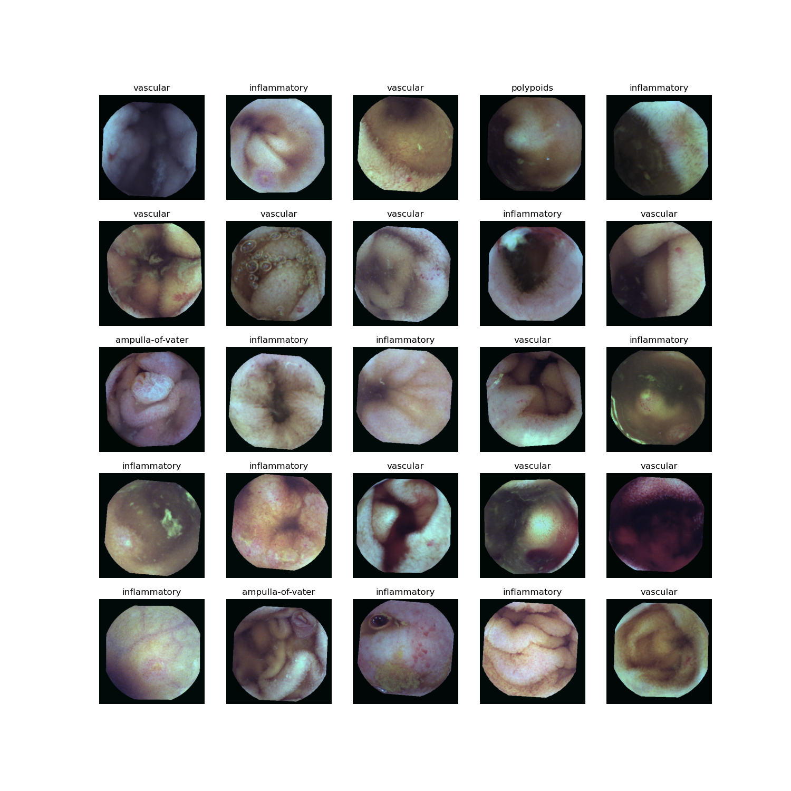
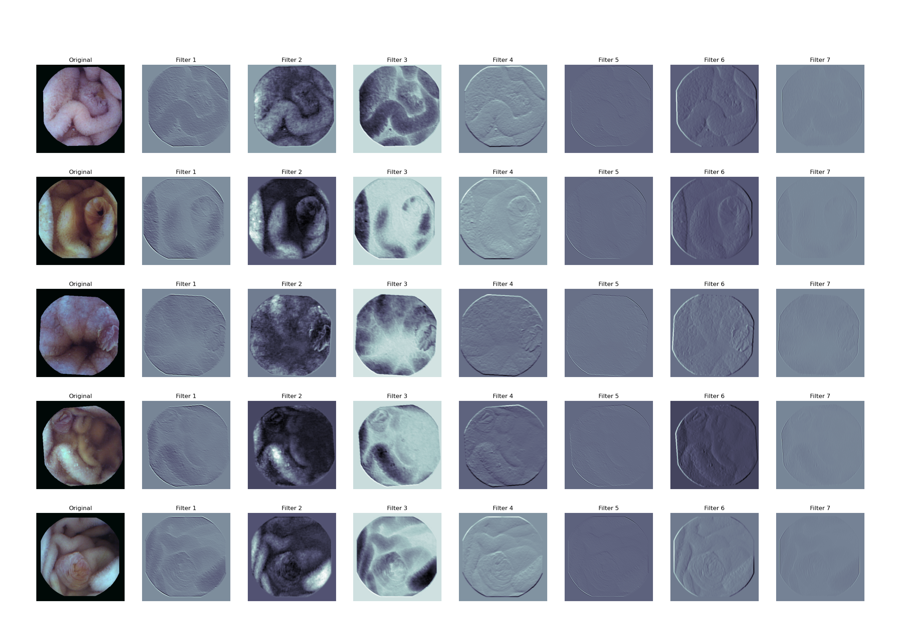

# Wireless Capsule Endoscopy Classification 

## Datasets
I am using publicly available [KID datasets](https://mdss.uth.gr/datasets/endoscopy/kid/) for training and testing purpose.  

KID1 dataset consists of nine abnormalities: Angioectasias, Aphthae, Bleeding, ChylousCysts, Lymphangectasias, Polypoids, Stenoses, Ulcers, and Villous Oedemas. 

KID2 dataset contains four abnormalities: Ampulla of Vater, Inflammatory, Polypoids, and Vascular. 

Since annotated data is inadequate to get good classification accuracy, I am using [Albumentations](https://albumentations.ai/docs/) for data augmentation. 

## Using ResNet 

*Fig. 1 Images used for training the model.*

*Fig. 2 Images used for testing the model.*

*Fig. 3 Outputs of the filters performing various image processing techniques like edge detection, colour invervion etc.*

*Fig. 4 Learning rate finder - around $1x10^{-3}$ loss is mimimum.*

## Using Vision Transformers

Implementation of [Vision Transformers](https://arxiv.org/abs/2010.11929) paper for the classification task of the trails generated by a Wireless Capsule Endoscopy (WCE).

*Fig. 5 Illustrates the overview of the model. The images are first divided into patches followed by position embedding, which then passed to the Transformer encoder. To perform classification, an extra learnable “classification token” is added to the sequence.*

## Results

| Model              | #Images | Accuracy |
|--------------------|---------|----------|
| Resnet50           | 593     | 0.84     |
| Vision Transformer | 593     | 0.85     |

---
### Important Links:

[Official Vision Transformer Github Repo](https://github.com/google-research/vision_transformer)
|
[Pytorch Model of Vision Transformer](https://github.com/rwightman/pytorch-image-models/tree/master/timm/models)

---